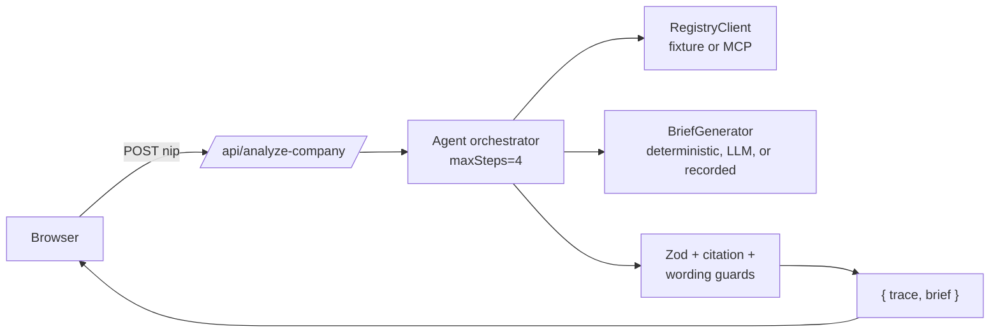

# FirmaScope

**Agentic due diligence for Polish companies, powered by MCP.**

Enter a NIP (Polish tax ID); FirmaScope calls [PBI-MCP](https://github.com/neflingcreations/PBI-MCP) — an MCP server for Polish business registry data — then an LLM generates a structured, per-claim-cited due-diligence brief, validated against a Zod schema and a code-level safety guard before it ever reaches the screen.

<!-- TODO: add a screenshot or short GIF of the app in action here. -->

**Live demo:** see your Dokploy dashboard for the current URL (deployed key-free, fixture + recorded mode — see [Demo vs. live mode](#demo-vs-live-mode) below).

## Quickstart

```bash
npm install
npm run dev
```

No API keys required. Default mode (`REGISTRY_SOURCE=fixture`, `BRIEF_GENERATOR=recorded`) replays committed fixture registry data and a real, previously-recorded LLM brief.

## What & why

If you're a freelancer or small business about to invoice a new Polish client, you want a quick sanity check on their VAT registration before you sign anything — not a black-box yes/no, but something you can actually verify. FirmaScope takes a NIP, looks it up against the VAT whitelist via PBI-MCP, and produces a summary where **every factual claim is tied to a citation** you can trace back to the exact tool call that produced it.

This is also the interview story it's built to tell: an open-source MCP server for a real data domain (PBI-MCP), and an agentic Next.js app consuming it end to end — structured outputs, grounding/citations, and automated evals, not just a chat wrapper.

## Architecture



Full write-up, mode-switch table, and the guard layer: [docs/architecture.md](docs/architecture.md).

## Agent workflow

1. **Validate** the NIP (format + checksum) — invalid input short-circuits before any tool call.
2. **Registry lookup** via `RegistryClient` (fixture data or, on the roadmap, live PBI-MCP).
3. **Generate** a brief via `BriefGenerator` — deterministic code, a real LLM call, or a replayed recorded run.
4. **Guard**: Zod schema validation, every citation resolves, disclaimer present, no forbidden wording. Any failure swaps in a safe `insufficient_data` fallback — nothing unvalidated reaches the UI.

Every step appends a `TraceEvent`; the full trace is returned and animated client-side.

## Schema (excerpt)

```ts
export const ClaimSchema = z.object({
  text: z.string(),
  citationIds: z.array(z.string()).min(1), // factual claims MUST cite
});

export const CompanyBriefSchema = z.object({
  input: z.object({ nip: z.string() }),
  verdict: z.enum(["low_risk", "needs_manual_review", "insufficient_data"]),
  summary: z.string(),
  registryFacts: z.array(ClaimSchema),
  riskSignals: z.array(RiskSignalSchema),
  unknowns: z.array(z.string()),   // no citations required
  citations: z.array(CitationSchema),
  disclaimer: z.string(),           // must be present
});
```

Full schema: [`src/lib/firmascope/schema.ts`](src/lib/firmascope/schema.ts).

## Grounding & citations

The LLM never invents registry facts — it only narrates the exact JSON returned by the registry lookup, and every `registryFact`/`riskSignal` must carry a `citationIds` array pointing at a real `Citation` entry (tool call id, source name, retrieval timestamp, raw fixture/response path). A code guard — not just a prompt instruction — rejects any brief where a citation doesn't resolve. Missing data becomes an `unknowns` entry, never a fabricated fact.

## Eval results

9 golden cases (active company, second/third realistic active companies, a company with a real removal/restoration history, partial data, not found, malformed response, 2 invalid inputs), 6 metrics each, scored against a genuinely fresh live LLM run:

**9/9 passed.** Full table: [docs/eval-results.md](docs/eval-results.md). What these metrics do and don't catch: [docs/limitations.md](docs/limitations.md#eval-metrics-mostly-guard-the-guard-layer-not-the-model-directly).

Run it yourself:
```bash
npm run eval          # fixture + recorded, CI-safe, no keys
EVAL_LIVE=1 npm run eval   # real OpenRouter calls, needs .env.local
```

## Demo vs. live mode

Two independent switches (server env only, never client-controlled):

| | Fixture / Recorded (default) | MCP / LLM |
| --- | --- | --- |
| Keys needed | None | `OPENROUTER_API_KEY`, `OPENROUTER_MODEL` (and a local PBI-MCP process for live registry) |
| Registry data | Committed fixtures (`fixtures/vat-whitelist/`) | Live PBI-MCP call (not wired for v0.1 — roadmap) |
| Brief | Replayed real LLM output (`fixtures/runs/`) or deterministic code | Fresh LLM call each request |

The deployed demo intentionally only resolves 9 specific NIPs (fixture data + a genuinely recorded LLM brief for each) — any other NIP correctly returns "not found." This is a deliberate scope boundary, not a bug — see [docs/limitations.md](docs/limitations.md#the-public-demo-only-resolves-9-specific-nips).

## Prompt iteration

Prompt source: [`prompts/company-brief.v1.md`](prompts/company-brief.v1.md). Changelog of iterations: [`prompts/changelog.md`](prompts/changelog.md).

## Built on PBI-MCP

FirmaScope is the client side of a two-repo MCP workflow: [PBI-MCP](https://github.com/neflingcreations/PBI-MCP) is the MCP server (Python/FastMCP) exposing Polish business registry tools; this repo wraps its `lookup_company_json` tool behind a swappable `RegistryClient` interface. Integration notes (tool contract, transport, real sample output): [docs/integration-notes.md](docs/integration-notes.md).

## Limitations

Not legal, financial, or accounting advice — a registry-summary due-diligence assistant limited to available registry data. Full list (scope, demo-mode boundaries, eval caveats): [docs/limitations.md](docs/limitations.md).

## Roadmap

Live KRS/CEIDG/REGON MCP tools · live MCP wiring on Dokploy · side-by-side model comparison · SSE streaming trace · monitoring webhook · PDF export · grounded follow-up questions. Details: [docs/limitations.md](docs/limitations.md#roadmap).

## Scripts

```
npm run dev|build|lint|typecheck|test|test:watch|eval
```

See [CLAUDE.md](CLAUDE.md) for phase-by-phase conventions.
