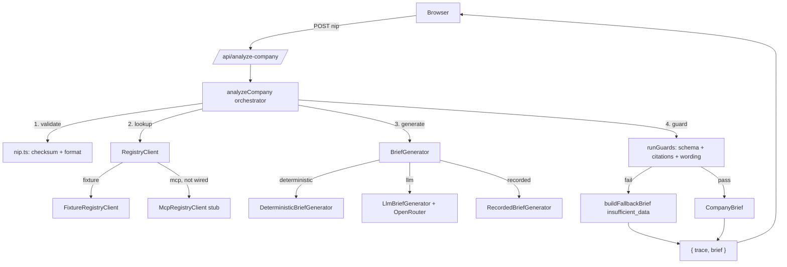

# Architecture

## Request flow



`maxSteps = 4`: validate NIP → registry lookup → generate brief → validate/guard. Every step appends a `TraceEvent`; the full trace is returned alongside the brief so the UI can render an audit trail, not just a final answer.

## The two mode switches

Set as **server environment variables only** — never accepted from the request body, so a client can't force a live call:

```ts
// src/app/api/analyze-company/route.ts
function resolveRegistryClient(): RegistryClient {
  if (process.env.REGISTRY_SOURCE === "mcp") return new McpRegistryClient(...);
  return new FixtureRegistryClient();
}
function resolveBriefGenerator(): BriefGenerator {
  const mode = process.env.BRIEF_GENERATOR ?? "recorded";
  if (mode === "deterministic") return new DeterministicBriefGenerator();
  if (mode === "llm") return new LlmBriefGenerator(...);
  return new RecordedBriefGenerator();
}
```

| `REGISTRY_SOURCE` | `BRIEF_GENERATOR` | Behavior |
| --- | --- | --- |
| `fixture` (default) | `recorded` (default) | Zero keys. Registry data comes from `fixtures/vat-whitelist/*.json`; the brief replays a real, previously-recorded LLM output from `fixtures/runs/{nip}.json`. This is what the public demo runs. |
| `fixture` | `deterministic` | Zero keys. Same fixture data, but the brief is assembled by code (`DeterministicBriefGenerator`) instead of an LLM — the skeleton that was built and tested before the LLM layer existed, and still the safety-net fallback path. |
| `fixture` | `llm` | Needs `OPENROUTER_API_KEY`/`OPENROUTER_MODEL`. Makes a real OpenRouter call against fixture registry data — used to (re-)record the runs above via `scripts/record-llm-runs.ts`. |
| `mcp` | any | Not wired for v0.1 — `McpRegistryClient` throws explicitly rather than faking live data. See [limitations](./limitations.md). |

## Guard layer (the one rule that matters)

Every `CompanyBrief` — deterministic or LLM-generated — passes through `runGuards()` (`src/lib/firmascope/agent.ts`) before it can reach the response:

1. Zod schema validation (`CompanyBriefSchema`).
2. Every citation id on every `registryFact` and `riskSignal` resolves to an entry in `citations`.
3. `disclaimer` is non-empty.
4. No forbidden wording (`findForbiddenWording` — the §12 phrase list: "safe company", "guaranteed", "credit score", etc.).

On failure: for the LLM path, one repair retry (re-prompted with the specific issue). If that also fails, or the deterministic path itself somehow fails, `buildFallbackBrief()` returns a schema-valid `insufficient_data` brief — which itself always passes all four checks. **Nothing reaches the UI without passing this gate.**

## UI

`src/app/page.tsx` (client component, holds analyze state) composes `src/components/firmascope/`: `Hero`, `DemoNotice`, `NipForm` (client-side checksum validation for instant feedback, plus sample-NIP buttons), `TracePanel` (animates the 4 trace steps), `VerdictStamp`, `BriefView` (facts/signals/unknowns/disclaimer, citation superscripts), `CitationPanel` (footnote-style source ledger, keyed off citation `id`, not `toolCallId` — see limitations).

## Deployment

Dokploy (self-hosted, Docker-container based — not serverless). `Dockerfile` builds Next.js with `output: standalone` and explicitly copies `fixtures/` and `prompts/` into the final image, since those are read at runtime via `readFileSync(process.cwd(), ...)` rather than imported, so Next's file tracer can't see them. GitHub Actions (`.github/workflows/ci.yml`) runs lint/typecheck/test/eval/build on every push — no deploy step, since Dokploy pulls from GitHub independently.

## Eval harness

`src/lib/evals/`: `golden-cases.ts` (9 cases) → `run-evals.ts` (drives `analyzeCompany` against each, always through `FixtureRegistryClient`; `BRIEF_GENERATOR` is `RecordedBriefGenerator` by default or a real `LlmBriefGenerator` when `EVAL_LIVE=1`) → `score.ts` (6 metrics per case). Results print as a table and are written to `docs/eval-results.md`. See [limitations](./limitations.md) for what these metrics do and don't actually catch.
